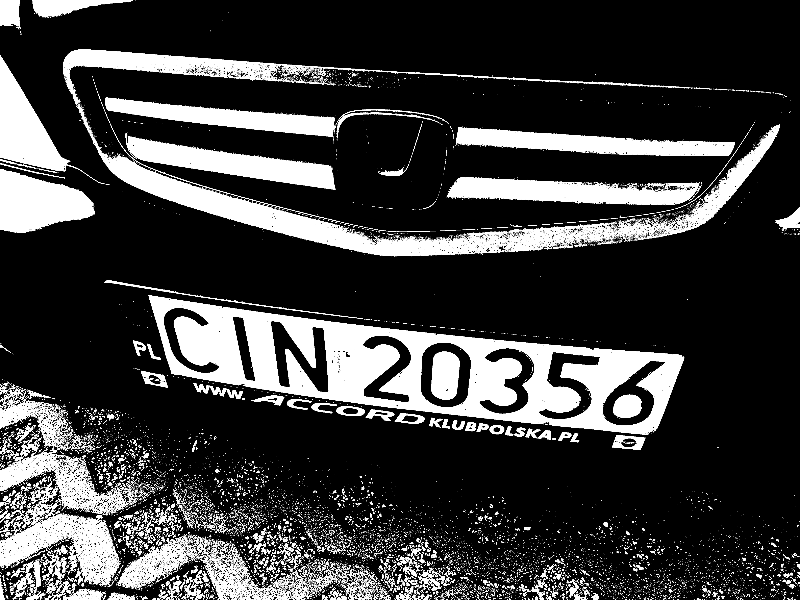
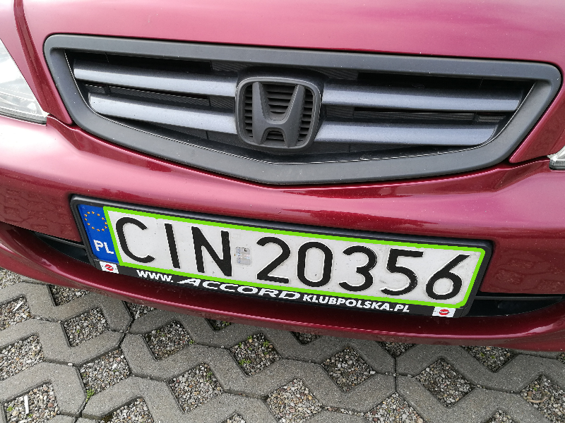
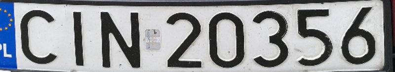
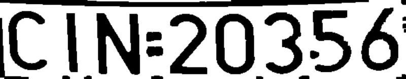
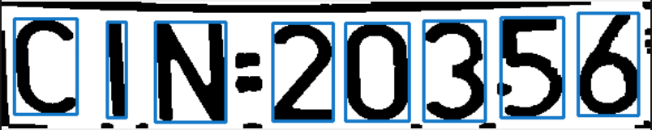
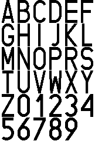

# License Plate Recognition

This repository contains a license plate recognition system that uses OpenCV library to detect and recognize license plates in images.

First, each image is normalized to a fixed size. Next, the license plate is detected and transformed using the `detect_license_plate()` function. The license plate is then passed to the `ocr()` function, which segments the characters and recognizes them. At the end, the recognized license number is validated using the `validate_license_plate()` function.

## License Plate Detection

At the beginning, a mask is created to filter out the license plate region based on color. Next, countours are detected and the most probable license plate region is selected based on the area and aspect ratio, width and height.

<br>
<div align="center">
  
&nbsp; &nbsp; &nbsp; &nbsp;
  
  <br><br>
  <em>Mask and license plate detection.</em>
</div>
<br>

The contour is then approximated to a polygon and the license plate region is extracted. A perspective transformation is applied to the license plate region to correct the perspective distortion. Lastly, the license plate region is denoised, converted to grayscale and thresholded. A set of morphological operations is applied to the thresholded image to further remove noise and enhance the characters.

<br>
<div align="center">
  
&nbsp; &nbsp; &nbsp; &nbsp;
  
  <br><br>
  <em>Perspective transformation and thresholding.</em>
</div>
<br>

## Character Segmentation & Recognition

On each license plate region, edges are detected using the Canny edge detector. Next, contours are extracted and a set of conditions is applied to filter out the best candidates for the license plate characters. The contours are then sorted from left to right and the characters are segmented.

<br>
<div align="center">
  
&nbsp; &nbsp; &nbsp; &nbsp;
  
  <br><br>
  <em>Edge detection and character segmentation.</em>
</div>
<br>

The template matching technique is used to match the license plate characters with the characters in the license plate template. The template characters are resized to the same size as the segmented characters and each character is matched with the template characters. The character with the highest confidence is selected as the recognized character.

<br>
<div align="center">
  
  <br><br>
  <em>Font characters template.</em>
</div>
<br>

For the purpose of this project, font characters has been generated using the `font_generate.sh` script. The generated font characters are stored in the `character` directory.

## Installation

Install the required dependencies using the following command:

```bash
pip install -r requirements.txt
```

## Usage

To test the license plate recognition, run the following command:

```bash
./tools/match_count.sh
```

This will run the license plate recognition on the images in the `train_set` directory and print the number of matches.

```bash
License plate: CIN20356 | Confidence: 0.8262371
License plate: CMG21FG | Confidence: 0.85745335
License plate: FSD23429 | Confidence: 0.91215897
License plate: PCT15PY | Confidence: 0.8473719
[...]
Match: PZ0460J PZ04603 | Points: 6
Match: PZ492AK PZ492AK | Points: 10
Match: WSCUP62 WSCUP62 | Points: 10
Match: ZSL17729 ZSL17729 | Points: 11

License plates detected: 26/26
Total points: 259/267
```

## License

This repository is licensed under the MIT License - see the [LICENSE](LICENSE.md) file for details.
